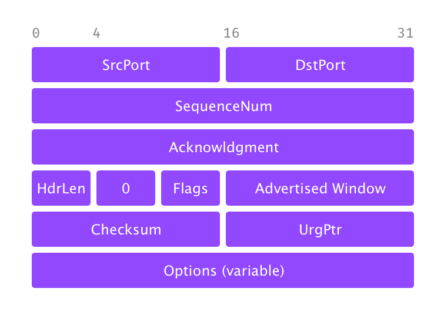
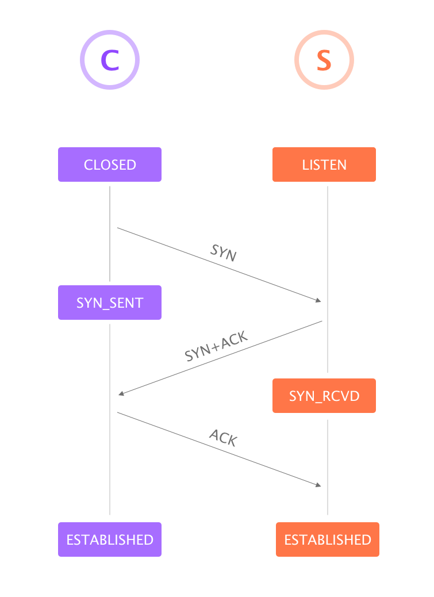
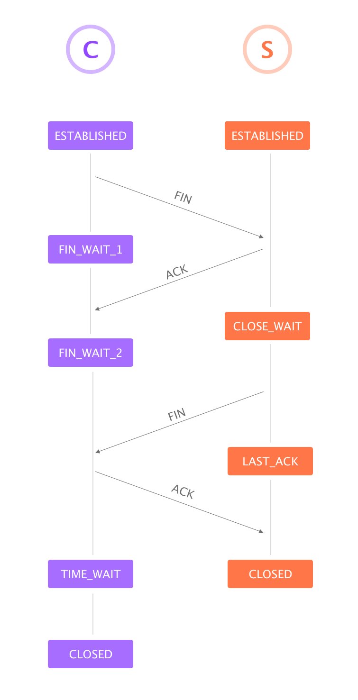

# Note

- TCP guarantees the reliable, in-order delivery of a stream of bytes.
- At the heart of TCP is the sliding window algorithm

# TCP Segment

## 报文头字段
-  **SrcPort:** Source port
-  **DstPort:** Destination port
-  **SequenceNum:** Sequence number of first byte
-  **Acknowledgment:** Carry information about the flow of data going in the other direction
-  **AdvetisedWindow:** Carry information about the flow of data going in the other direction
-  **Flags:** Relay control information (`SYN`, `FIN`, `RESET`, `PUSH`, `URG`, `ACK`)
-  **Checksum:** Compute
-  **Hdrlen:** Offset

> 一句话总结：TCP 报文头总共包含 24 个字节：前 4个字节（`SrcPort`, `DstPort`）定义源端口和目标端口；11个字节（`SequenceNum`, `Acknowledgment` 和 `AdvertisedWindow`）用于 TCP 的 Sliding window algorithm。`Flags` 字段用于传输一些相应信息（例如建立和断开连接时用到的 `SYN`, `FIN` 和 `ACK`）。

# 建立和断开 TCP 连接 

> TCP 连接原则是时对称的，即两个端都有发起连接和断开的能力，但通常情况下会有一个端进行 Active open 主动开启连接而另一端进行 Passive open 被动接受连接

## 三次握手 

## 四次挥手 

